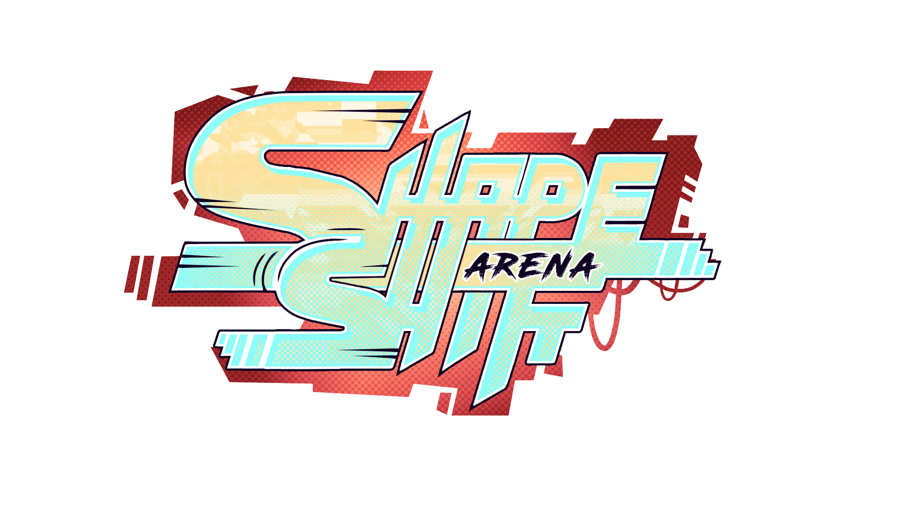
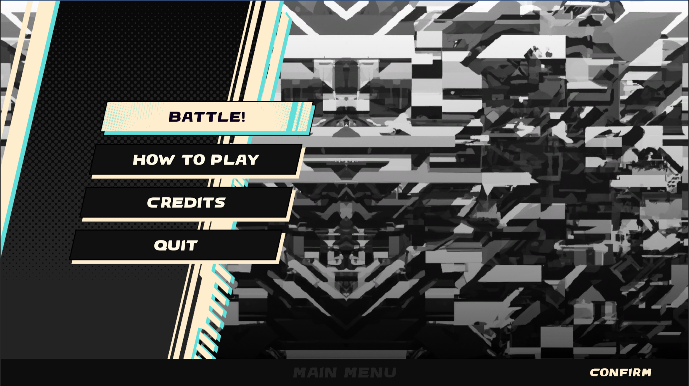
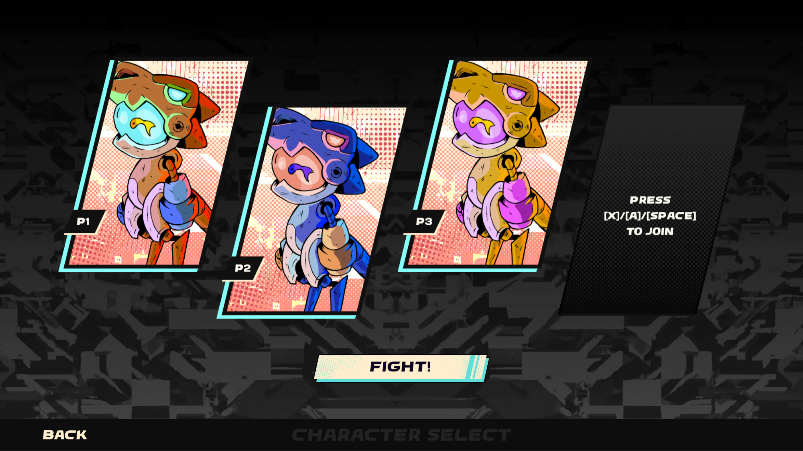
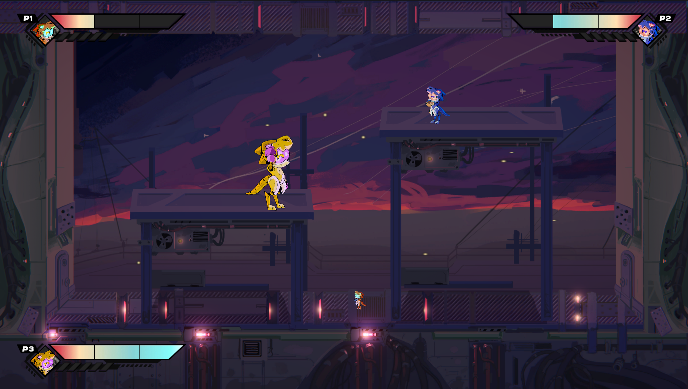

# ShapeShift Arena

## Presentation

>### Size does matter!
>
>**Enters the arena and smash them before they get you!**

This game was made for the [GameOff 2023](https://itch.io/jam/game-off-2023)

Shapeshift Arena is a fighting game for up to 4 players.

Use your sizeshift gun to shrink or enlarge your opponent and smash them against the arena’s deadly walls.
The bigger you are and the smaller your opponent, greater is the impact.  So maneuver well and fast to take the lead!
The game ends when one of the players has won 5 rounds. **Good luck!**

### Screenshots

## Features
- Playable with controller 
- Multiplayer local
- 2D plateformer character controller
- Shooting mechanics

## Team
| Member |   |
| ------ | - |
| 🖌️ [Clara Boudarchan (Kurara)](https://www.artstation.com/clara_boudarchan)   | Character Art     | 
| 🖌️ [Hugo Bayle (Napolo)](https://napolo.itch.io/)                             | Environment Art   | 
| 🖌️ [ Yona Rivet (Yiokse)](https://www.artstation.com/clara_boudarchan)        | User Interface    |
| 💻 [Gaël Edern (Darnagof)](https://darnagof.itch.io/)                         | Developer         | 
| 💻 [Lucas Vasseur (Shirakawa)](https://shirakawa42.itch.io/)                  | Developer         | 
| 💻 [Théo Carrasco (EyeCrown)](https://eyecrown.itch.io/)                      | Developer         | 
| 🎵 [Fred Kukovicic](https://fredkvc.itch.io/)                                 | Music             | 